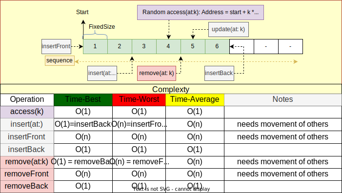
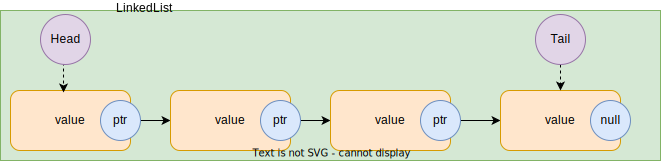
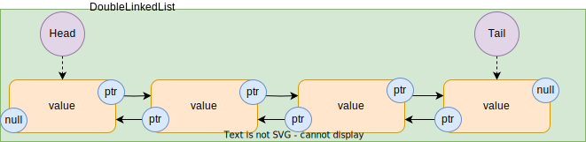
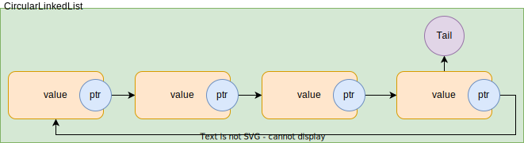
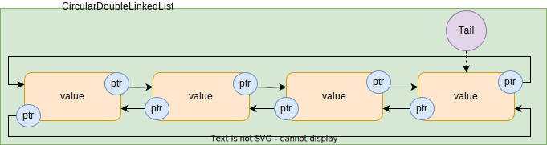
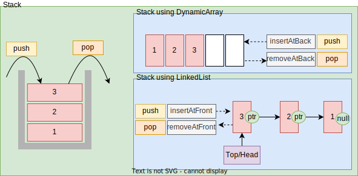
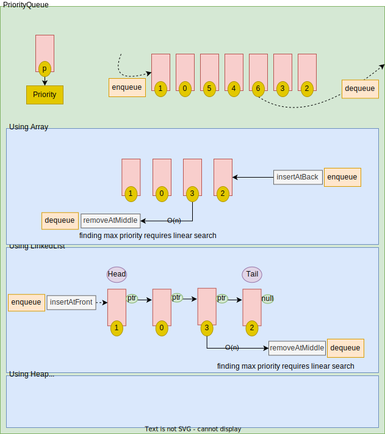
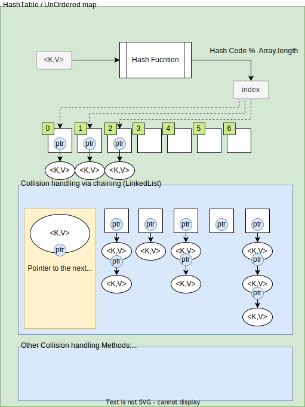
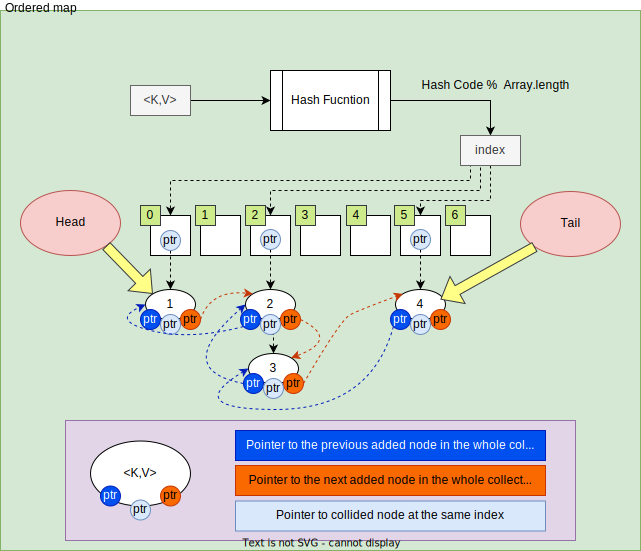

- [Data (Memory) + Algorithm](#data-memory--algorithm)
  - [Physical layer](#physical-layer)
  - [Virtual layer](#virtual-layer)
    - [Location](#location)
    - [Arrangement](#arrangement)
  - [Algorithms](#algorithms)
    - [Fundamental operations](#fundamental-operations)
    - [Fundamental Algorithms](#fundamental-algorithms)
      - [Sorting algorithms](#sorting-algorithms)
      - [Searching algorithms](#searching-algorithms)
    - [Algorithm design techniques](#algorithm-design-techniques)
  - [Data structures](#data-structures)
    - [Contiguous-Memory data structures](#contiguous-memory-data-structures)
    - [Discontiguous-Memory data structures](#discontiguous-memory-data-structures)
    - [Combination of CM and DCM](#combination-of-cm-and-dcm)
    - [Linear structures](#linear-structures)
      - [Array data structures](#array-data-structures)
        - [Array](#array)
        - [DynamicArray](#dynamicarray)
        - [RingBuffer](#ringbuffer)
      - [Linked data stuctures](#linked-data-stuctures)
        - [LinkedList](#linkedlist)
        - [DoubleLinkedList](#doublelinkedlist)
        - [CircularLinkedList](#circularlinkedlist)
        - [CircularDoubleLinkedList](#circulardoublelinkedlist)
      - [Stack](#stack)
        - [Stack via DynamicArray](#stack-via-dynamicarray)
        - [Stack via LinkedList](#stack-via-linkedlist)
        - [Stack via deque](#stack-via-deque)
      - [Queue](#queue)
        - [Queue via DoubleLinkedList](#queue-via-doublelinkedlist)
        - [Queue via RingBuffer](#queue-via-ringbuffer)
        - [Queue via Double Stack (Stack via DynamicArray)](#queue-via-double-stack-stack-via-dynamicarray)
        - [Deque (Double-ended Queue) as Queue](#deque-double-ended-queue-as-queue)
      - [Deque](#deque)
        - [Deque via DoubleLinkedList](#deque-via-doublelinkedlist)
        - [Deque via Array](#deque-via-array)
      - [PriorityQueue](#priorityqueue)
        - [PriorityQueue via DynamicArray](#priorityqueue-via-dynamicarray)
        - [PriorityQueue via LinkedList](#priorityqueue-via-linkedlist)
        - [PriorityQueue via Deque](#priorityqueue-via-deque)
        - [PriorityQueue via BinaryHeap](#priorityqueue-via-binaryheap)
      - [Associative collections](#associative-collections)
        - [UnorderedMap (HashTable)](#unorderedmap-hashtable)
        - [OrderedMap via HashTable + LinkedList](#orderedmap-via-hashtable--linkedlist)
        - [SortedMap via Self Balancing Tree](#sortedmap-via-self-balancing-tree)
      - [Set](#set)
        - [UnorderedSet](#unorderedset)
        - [OrderedSet via HashTable + LinkedList](#orderedset-via-hashtable--linkedlist)
        - [SortedSet via Self Balancing Tree](#sortedset-via-self-balancing-tree)
    - [Non-Linear structures](#non-linear-structures)

# Data (Memory) + Algorithm
Imagine you have a bunch of data-blocks. |A|,|B|,|C|,|D|,|E|,... Your goal is to solve a problem by puting this data in an algorithm and get the result. Depending on the problem and the algorithm, you need to go through some steps like this:
1. Allocate some space (memory to your data)
2. Arrange your data-blocks in the allocated space and create a logical relationship(Implicit or explicit) among them. (Specify a `Data Structure`)
3. Doing Some operations on the data-blocks(`Algorithm`): These operations may include:
  - Read data-blocks
  - Write data-blocks

Data structures and algorithms are closely intertwined concepts. Certain algorithms exhibit better efficiency when used with specific data structures, and conversely, certain data structures offer advantageous arrangements that enhance the efficiency of particular algorithms. To efficiently solve problems, it is crucial to design both efficient algorithms and appropriate data structures. Designing these efficient solutions necessitates a solid understanding of the fundamentals and analysis techniques involved.

## Physical layer
The physical layer of a computer system is responsible for the actual storage and retrieval of data in electronic or magnetic form. Memory in the physical layer is organized hierarchically, with different types and levels of memory. Types of Memory in the Physical Layer:
- Registers
- Cache Memory
- Main Memory (Random Access Memory - RAM)
- Secondary memories: (HDD,SSD,...)
Physical memory is invisible to programs in virtual memory systems and as a programmer you're not required to reason about it.

## Virtual layer
Where and how memory is being allocated in virtual layer?
### Location
- `Stack`: Fast allocation. Faster access.
  1. Moving just an integer pointer allocates/deallocates memory.
- `Heap`: Slow Allocation. Slower acess.
  1. Search heap.
  2. Sync heap for other threades.
  3. Allocate memory.
### Arrangement
- `Contiguous`: Bulk allocation in continuous memory block. (faster access).
- `Discontiguous`: Dynamic allocation in separated memory blocks.(slower access).

---

## Algorithms
The base operations for all algorithms are `access` to and possibly `mutate` the data blocks regardless of how we arrange our data-blocks in memory and what are the logical connections between them. At this level, all algorithms can be reduced to one or some of the following operations.
### Fundamental operations
- `read`
  - accessDataBySequence() (Either forward or backward)
  - getIndexingInformation(): `getStartIndex()`, `getEndIndex()`, `getNextIndex(forIndex)`, `getPreviousIndex(forIndex)`
  - accessDataAtRandomIndex(:): For Random access, time complexity should be of order `O(1)`.
  - accessDataAtFront()
  - accessDataAtBack()
- `write`
  - inserDataAtRandomIndex(:)
  - insertDataAtFront()
  - insertDataAtBack()
  - removeDataAtRandomIndex(:)
  - removeDataAtFront()
  - removeDataAtBack()
  - updateDataAtRandomIndex(:)
  - updateDataAtFront()
  - updateDataAtBack()

A note on `Random Access`: In the context of data structures, random access refers to the ability to instantly access a specific location. With [Array](#array), for instance, if you select a random index, the Array data structure can immediately provide you with the address of that index. However, if you attempt to access a random index in a [LinkedList](#linkedlist), the data structure cannot instantaneously provide the address. Instead, it must iterate from the beginning (starting from head) until it reaches the desired index. Consequently, LinkedLists are considered to have a time complexity of `O(n)` (Upper bound) for random access operation. Most algorithms require `O(1)` random access, and languages such as Java have introduced a marker interface(with no methods) called [RandomAccess](https://github.com/openjdk/jdk/blob/master/src/java.base/share/classes/java/util/RandomAccess.java). This interface serves as a reminder that certain algorithms rely on random access. To ensure that these algorithms perform efficiently with your data structure, it is necessary to make it compatible with random access. The Swift equvalent is a marker protocol [RandomAccessCollection](https://github.com/apple/swift/blob/main/stdlib/public/core/RandomAccessCollection.swift).

### Fundamental Algorithms
Fundamental operations form the building blocks upon which algorithms are constructed. Conversely, certain algorithms play fundamental rules for other algorithms. Take, for instance, the impact of input data order on the time efficiency of algorithms. Sorting the data beforehand can greatly simplify our lives, as it has a significant positive effect on the efficiency of numerous algorithms. Sorting can be accomplished through two methods. The first method involves utilizing a sorting algorithm to arrange an unsorted collection. The second method involves utilizing specific data structures, such as binary search trees, that facilitate the sorting of data through amortization.
#### Sorting algorithms
All sort algorithms need `getIndexingInformation`, `accessDataAtRandomIndex(:)` operations. Also items must be comparable (unless for non-comparison algorithms).
- In-place sorting algorithms: They need  `updateDataAtRandomIndex(:)` operation.
  1. Bubble sort
  2. Selection sor
  3. Insertion sort
  4. Heap sort
  5. Quick sort
- Not In-Place Sorting Algorithms:
  1. Merge sort
  2. Radix sort (non-comparison)
  3. Bucket sort (non-comparison)

#### Searching algorithms
- Linear search: needs `accessDataBySequence()`
- Binary search: needs `accessDataAtRandomIndex(:)` with `O(1)`

### Algorithm design techniques
- Divide and conquer
- Recursion
- Randomized algorithms: Input MUST be RANDOM.
- Dynamic programming
- Greedy algorithms

---

## Data structures
Each data structure has the following characteristics:
- `Virtual layer Memory management` at the virtual layer.
- `Logical connection` between data-blocks, either `implicit` or `explicit`.
  - Implicit: In an [Array](#array)  data-blocks have no direct connection, but implicitly they are arranged in a specific order contiguously in memory.
  - Explicit: In [LinkedList](#linkedlist) the blocks may not be stored contiguously in memory, but each node has the connection information to some other nodes.
- `Rules` for applying basic operations.
- Provides basic `read` and `write` operations with a space/time complexity. The space/time complexities for data structures for basic operations can easily be analysed using the following concepts: [Contiguous-Memory data structures](#contiguous-memory-data-structures) and [Discontiguous-Memory data structures](#discontiguous-memory-data-structures)

### Contiguous-Memory data structures
- Init with fixed size. size stays fixed.
- Address of each block can be calculated via: `start + k * blocksize`. Random access time complexity is `O(1)`
- Bulk memory allocation
- Same size memory blocks (Same type)
- Base data Structure example: Array

### Discontiguous-Memory data structures
- This arrangement is a special kind of Graph (We can represent graphs using it).
- Each block contains the address of next block.
- Time complexity for random access operation is `O(n)`
- Dynamic memory allocation
- Memory block sizes can be different (Differnt types).
- Base data structure example: LinkedList

### Combination of CM and DCM
- A contigues-memory array of pointers to contiguous-memory or discontiguous-memory collection of objects. 
- Time complexity for random access operations is `O(1)`
- Bulk memory allocation for address (pointer) array, dynamic memory allocation for objects.
- Objects can have different memory sizes (different types).
- Base data structure example: An array of referenced objects in most programming languages.

### Linear structures
By employing one or a combination of the aforementioned concepts, basic data structures can be implemented, serving as the foundation for more intricate data structures. Additionally, the space and time complexities, as well as memory costs, can be readily analyzed by leveraging the complexities and costs associated with these fundamental concepts.
#### Array data structures
##### Array
In Programming languages, Arrays are built-in types. Array of pointers (or array of reference types) acts like [Combination of CM and DCM data structures](#combination-of-cm-and-dcm-data-structures). For primitive types (or value types like Int, enum, struct in C#,Swift,...) the behaviour is like [Contiguous-Memory data structures](#contiguous-memory-data-structures) .
- `Basic operations` time complexity: Same as [Contiguous-Memory data structures](#contiguous-memory-data-structures)
- `Good`: 
  - `accessAtRandomIndex`, `insertAtBack`, `removeAtBack` operations. 
  - Bulk memory allocation (fast).
  - Contiguous memory. Fast access.
  - If used with primitive types (Value types), no dynamic memory allocation cost.
- `Not good`:
  - `insertAtFront`, `insertAtMiddle`, `removeAtFront`, `removeAtMiddle` Operations. 
  - Fixed size.
- Programming Languages implementations:
  - Cpp: [Array](https://cplusplus.com/reference/array/array/) size is compile-time constant.
  - Swift: Arrays in swift are dynamic.
  - Python: Python [array](https://docs.python.org/3/library/array.html) size is compile-time constant.
  - Java: [array](https://docs.oracle.com/javase/8/docs/api/java/util/Arrays.html) size is compile-time constant.
  - C#: [Array](https://learn.microsoft.com/en-us/dotnet/api/system.array?view=net-7.0) size is compile-time constant.
  - JavaScript: Arrays in Javascript are dynamic.

##### DynamicArray
Similar to array, but can grow at runtime. DynamicArray of pointers (or DynamicArray of reference types) acts like [Combination of CM and DCM data structures](#combination-of-cm-and-dcm-data-structures). For primitive types (or value types like Int, enum, struct in C#,Swift,...) the behaviour is like [Contiguous-Memory data structures](#contiguous-memory-data-structures). Steps for resizing:
  - allocate new array with new size
  - copy the old array values to the new array
  - delete the old array
- `Basic operations` time complexity: Same as [Contiguous-Memory data structures](#contiguous-memory-data-structures)
- `Good`: 
  - `accessAtRandomIndex`, `insertAtBack`, `removeAtBack` operations. 
  - Bulk memory allocation (fast).
  - If used with primitive types (Value types), no dynamic memory allocation cost.
- `Not good`: 
  - `insertAtFront`, `insertAtMiddle`, `removeAtFront`, `removeAtMiddle` Operations. 
  - New memory allocations and copy cost when capacity is full. 
  - Has unused memory allocation based on growth strategy. For example in Swift programming language, each time an array capacity is full, it double the capacity of the array.
- Programming Languages implementations:
  - Cpp: [Vector](https://cplusplus.com/reference/vector/vector/).
  - Swift: [contiguousarray](https://developer.apple.com/documentation/swift/contiguousarray) and [array](https://developer.apple.com/documentation/swift/array) are dynamic. When capacity is full, the size gets doubled.
  - Python: [list](https://docs.python.org/3/library/stdtypes.html#lists) is a dynamic array of pointers to other objects. The behavior is always like [Combination of CM and DCM data structures](#combination-of-cm-and-dcm-data-structures).
  - Java: [ArrayList](https://docs.oracle.com/javase/8/docs/api/java/util/ArrayList.html) and [Vector](https://docs.oracle.com/javase/8/docs/api/java/util/Vector.html) are dynamic and the difference is that vector is threadsafe.
  - C#: [List](https://learn.microsoft.com/en-us/dotnet/api/system.collections.generic.list-1?view=net-7.0) is a dynamic array.
  - JavaScript: [Array](https://developer.mozilla.org/en-US/docs/Web/JavaScript/Reference/Global_Objects/Array) is dynamic.

##### RingBuffer
A ring buffer is a specialized data structure implemented using an array. It is a static-sized buffer where read and write operations occur through two distinct pointers that iterate through the array in a circular manner.

- `Basic operations` time complexity: Same as [Array](#array) with the following improvement:
  - `insertAtFront` is `O(1)`
  - `removeAtFront` is `O(1)`
- `Good`: 
  - `accessAtRandomIndex`, `insert` operation.
  - Bulk memory allocation (fast).
  - If used with primitive types (Value types), no dynamic memory allocation cost.
  - As it is fixed-size, we can map it to virtual memory layer memory page to make it super fast.
- `Not good`:
  - Fixed size.
  - Write operations may fail if the frequency of writes exceeds the frequency of reads.
- Programming Languages implementations:
  - Cpp: Has no built-in implementation for LinkedList. [Here](https://www.boost.org/doc/libs/1_77_0/doc/html/circular_buffer.html) is an implementation.
  - Swift: Has no built-in implementation for LinkedList. [Here](https://github.com/kodecocodes/swift-algorithm-club/blob/master/Ring%20Buffer/RingBuffer.swift) is an implementation.
  - Python: Has no built-in implementation for LinkedList. [Here](https://gist.github.com/edwintcloud/f998e15d839e17ebcae2b8e2bb1d8d8c) is an implementation.
  - Java: Has no built-in implementation for LinkedList. [Here](https://www.geeksforgeeks.org/java-program-to-implement-circular-buffer/) is an implementation.
  - C#: Has no built-in implementation for LinkedList. [Here](https://github.com/joaoportela/CircularBuffer-CSharp) is an implementation.
  - JavaScript: Has no built-in implementation for LinkedList. [Here](https://github.com/trevnorris/cbuffer) is an implementation.

#### Linked data stuctures
##### LinkedList

- `Basic operations` time complexity: Same as [Discontiguous -Memory data structure](#discontiguous--memory-data-structure) with one improvement.
  - `insertAtBack()` becomes `O(1)` because we keep track of tail.
  - `removeAtBack()` stays `O(n)` because we have to iterate from head to index n-1 to remove n.
- `Good`: 
  - `insertAtFront`, `removeAtFront`, `insertAtBack` operations. 
- `Not good`: 
  - `accessAtRandomIndex`, `removeAtBack`, `insertAtMiddle`, `removeAtMiddle` Operations. 
  - Dynamic memory allocation (slow).
- Programming Languages implementations:
  - Cpp: [forward_list](https://cplusplus.com/reference/forward_list/forward_list/).
  - Swift: Has no built-in implementation for LinkedList. An implementation can be found [here](https://github.com/kodecocodes/swift-algorithm-club/blob/master/Linked%20List/LinkedList.swift).
  - Python: Has no built-in implementation for LinkedList. An implementation can be found [here](https://github.com/M2skills/Linked-List-in-Python).
  - Java: [LinkedList](https://docs.oracle.com/javase/8/docs/api/java/util/LinkedList.html) is [DoubleLinkedList](#doublelinkedlist).
  - C#: [LinkedList](https://learn.microsoft.com/en-us/dotnet/api/system.collections.generic.linkedlist-1?view=net-7.0) is a [DoubleLinkedList](#doublelinkedlist).
  - JavaScript: Has no built-in implementation for LinkedList. an implementation can be found [here](https://github.com/datastructures-js/linked-list).

##### DoubleLinkedList

- `Basic operations` time complexity: Same as [Discontiguous -Memory data structure](#discontiguous--memory-data-structure) with two improvements:
  - `insertAtBack()` becomes `O(1)`.
  - `removeAtBack()` becomes `O(1)`. Now we have access to n-1 from n and we can remove the pointer to n from n-1.
- `Good`: 
  - `insertAtFront`, `removeAtFront`, `insertAtBack`, `removeAtBack` operations. 
- `Not good`: 
  - `accessAtRandomIndex`, `insertAtMiddle` Operations. 
  - Dynamic memory allocation (slow).
  - High overhead of extra storage for the forward and back reference.
- Programming Languages implementations:
  - Cpp: [list](https://cplusplus.com/reference/list/list/) is doubly linkedList.
  - Swift: Has no built-in implementation for DoubleLinkedList. An implementation can be founf [here](https://gist.github.com/loromits/945039733a1da524c82860a48d65fcf6).
  - Python: Has no built-in implementation for DoubleLinkedList. an implementation can be founf [here](https://github.com/OmkarPathak/Data-Structures-using-Python/blob/master/Linked%20Lists/DoublyLinkedList.py).
  - Java: [LinkedList](https://docs.oracle.com/javase/8/docs/api/java/util/LinkedList.html) is DoubleLinkedList.
  - C#: [LinkedList](https://learn.microsoft.com/en-us/dotnet/api/system.collections.generic.linkedlist-1?view=net-7.0) is DoubleLinkedList.
  - JavaScript:  Has no built-in implementation for DoubleLinkedList. An implementation can be found [here](https://github.com/jasonsjones/doubly-linked-list).

##### CircularLinkedList

- `Basic operations` time complexity: Same as [LinkedList](#linkedlist) with some more capabilities.
  - We can traverse to a previous node
  - We can traverse in loop.

##### CircularDoubleLinkedList

- `Basic operations` time complexity: Same as [DoubleLinkedList](#doublelinkedlist) with some more capabilities.
  - We can traverse to a previous node
  - We can traverse in loop in bothe direction.

#### Stack
Stack is a Last-In-First-Out(LIFO) data structure. Any data structure that is `Good` at insert/remove from one of the ends can be used as a container for Stack. Based on this, stacks can be implemented using [DynamicArray](#dynamicarray) (`Good` at add/remove from the back), [LinkedList](#linkedlist) (`Good` at add/remove from front), [DoubleLinkedList](#doublelinkedlist)(`Good` at add/remove from both front and back) and [Deque](#deque). Each implementation inherites `Good` and `Not Good` of the container data structure.

##### Stack via DynamicArray
- `Basic operations` time complexity: Same as [DynamicArray:](#dynamicarray)
- `Methods`:
  - `push()`: `insertAtBack` on array container.
  - `pop`: `removeAtBack` on array container.
- `Good`: 
  - `push()` and `pop()` are `O(1)` operations.
  - Bulk memory allocation for pointers.
  - If used with primitive types (value types), no dynamic memory allocation cost.
- `Not good`: 
  - New memory allocations and copy cost when internal array capacity is full. 
  - Has unused memory allocation based on growth strategy of the pointer array.
- Programming Languages implementations:
  - Cpp: [Stack](https://cplusplus.com/reference/stack/stack/). In CPP vector, deque and list(DoubleLinkedList) can be used as container for Stack.
  - Swift: Has no Stack in standard libraray. an implementation can be found [here](https://github.com/kodecocodes/swift-algorithm-club/blob/master/Stack/Stack.swift). 
  - Python: Has no built-in Stack in standard library. An implementation can be found [here](https://github.com/sreejithc321/Stack-in-Python).
  - Java: [Stack](https://docs.oracle.com/javase/8/docs/api/java/util/Stack.html) is implemented with dynamic array.
  - C#: [Stack](https://learn.microsoft.com/en-us/dotnet/api/system.collections.stack?view=net-7.0) is implemented with dynamic array as the container.
  - JavaScript: has no built-in stack data structure. an implementation can be found [here](https://github.com/krishheii/javascript-stack).

##### Stack via LinkedList
- `Basic operations` time complexity: Same as [LinkedList](#linkedlist). We use Head of LinkedList to insert/remove.
- `Methods`:
  - `push()`: `insertAtFront` on LinkedList container.
  - `pop`: `removeAtFront` on LinkedList container.
- `Good`: 
  - `push()` and `pop()` are `O(1)` operations.
- `Not good`: 
  - `accessAtRandomIndex` is `O(n)`.
  - Dynamic memory allocation (slow).

##### Stack via deque
[Deque](#deque) data structure can be implemented using [Deque via LinkedList](#deque-via-linkedlist) or [Deque via Array](#deque-via-array). The [Deque](#deque) can serve as a container for a Stack due to its behavior. C++ default container for Stack is deque.

#### Queue
Queue data structure is First-In-First-Out. Every data structure that is `Good` at addAtFront and removeAtBack or vice versa can be used as a container for Queue data structure. [DoubleLinkedList](#doublelinkedlist)(`Good` at add/remove at both ends) can be used as the containers for Queue data structure. Also [RingBuffer](#ringbuffer) can be used for fixed size queues. [DynamicArray:](#dynamicarray) is not a good container for queue data structure because of `O(n)` for insert operation. We can amortize this complexity using [Queue via Double Stack (Stack via DynamicArray)](#queue-via-double-stack-stack-via-dynamicarray). Another approach is storing contents in multiple smaller arrays, allocating additional arrays at the beginning or end as needed. Indexing is implemented by keeping a dynamic array or a LinkedList containing pointers to each of the smaller arrays. In this case, the cost of inserting reduced from `O(n)` to the `O(smallarray.length)`. This approach is used for [deque](#deque-via-array). 

##### Queue via DoubleLinkedList
- `Basic operations` time complexity: [DoubleLinkedList](#doublelinkedlist)
- `Methods`:
  - `enqueue()`: `insertAtFront` on DoubleLinkedList container.
  - `dequeue()`: `removeAtBack` on DoubleLinkedList container. 
- `Good`: 
  -  `enqueue()` and `dequeue()` are `O(1)` operations.
- `Not good`: 
  - `accessAtRandomIndex` operation.
  - Extra memory for forward/backward pointers.
  - Dynamic memory allocation (slow).
- Programming Languages implementations:
  - Cpp: [queue](https://cplusplus.com/reference/queue/queue/) in cpp can has deque or list (DoubleLinkedList) as the container. the default container is deque.
  - Swift: Has no built-in implementation for Queue. An implementation can be found [here](https://gitlab.com/agostini.tech/ATQueue).
  - Python: Has no built-in implementation for Queue. An implementation can be found [here](https://www.geeksforgeeks.org/python-queue-using-doubly-linked-list/).
  - Java: [LinkedList](https://docs.oracle.com/javase/8/docs/api/java/util/LinkedList.html) and [ArrayDeque](https://docs.oracle.com/javase/8/docs/api/java/util/ArrayDeque.html) have implemented Queue interface.
  - C#:[Queue](https://learn.microsoft.com/en-us/dotnet/api/system.collections.generic.queue-1?view=net-7.0) in c# uses circular buffer array.
  - JavaScript: an implementation can be found [here](https://github.com/datastructures-js/queue).

##### Queue via RingBuffer
- `Basic operations` time complexity: [RingBuffer](#ringbuffer)
- `Methods`:
  - `enqueue()`: `inserAtRandomIndex` on Array container.
  - `dequeue()`: `accessAtRandomIndex` on Array container. 
- `Good`: 
  -  `enqueue()` and `dequeue()` are `O(1)` operations.
  -  If used for primitive types (value types), No dynamic allocation.
- `Not good`: 
  - Fixed size, `enqueue()` may fail.
- Programming Languages implementations:
  - C#: [Queue](https://learn.microsoft.com/en-us/dotnet/api/system.collections.generic.queue-1?view=net-7.0) in c# uses circular buffer array.

##### Queue via Double Stack (Stack via DynamicArray)
If we use [DynamicArray](#dynamicarray) as container for our queue, the `dequeue()` time complexity would be `O(n)` (Adding items to start of an array is an `O(n)` operation ). But we can amortize this complexity to `O(1)` using two stacks. LeftStack for `enqueue()` and the RightStack for `dequeue()`. Each time the LeftStack is empty, copy the RightStack contents to the LeftStack. This operation guarantees First-In-First-Out for the queue.
- `Basic operations` time complexity: Similar to [Stack via DynamicArray](#stack-via-dynamicarray).
- `Methods`:
  - `enqueue()`: `insertAtBack` on left Array container (the enqueue stack).
  - `dequeue()`: `removeAtBack` on right Array container (the dequeue stack).
- `Good`: 
  -  `enqueue()` and `dequeue()` are `O(1)` operations.
  -  If used for primitive types (value types), No dynamic allocation.
- `Not good`: 
  - New memory allocations and copy cost when capacity is full. 
  - Has unused memory allocation based on growth strategy.

##### Deque (Double-ended Queue) as Queue

[Deque (Double-Ended Queue)](#deque) can be used as Queue.

#### Deque
Deque (Double-Ended Queue) are a type of Queue that `enqueue()` and `dequeue()` can happen at both ends. Every data structure that is `Good` at insert/remove from both ends can be used as a container for Deque data structure. The only data structure that fullfill this requirement is [DoubleLinkedList](#doublelinkedlist). [Array](#array) is not a good data structure for implementing Deque data structure directly. However we can use some tricks to use [Array](#array) as a container for Deque data structure. See [Deque via Array](#deque-via-array).

##### Deque via DoubleLinkedList
Implementing a Deque via [DoubleLinkedList](#doublelinkedlist) is strightforward as this data structure has `O(1)` for insertAtFront/removeAtFront and insertAtBack/removeAtBack operations.
- `Methods`:
  - `pushBack()`: insertAtBack of the DoubleLinkedList container.
  - `pushFront()`: insertAtFront of the DoubleLinkedList container.
  - `popBack()`: removeAtBack of the DoubleLinkedList container.
  - `popFront()`: removeAtFront of the DoubleLinkedList container.
- `Good`:
  - Easy implementation
- `Not Good`:
  - Random access operation. 
  - Dynamic memory allocation (slow).
  - High overhead of extra storage for the forward and back references.
- Programming Languages implementations:
  - Python: [deque](https://docs.python.org/3/library/collections.html#collections.deque) uses DoubleLinkedList internally.

##### Deque via Array
As it was the case for Queue data structure, [Array](#array) cannot be used as a container for Deque data structure directly because insertAtFront/removeAtFront operations are not `O(1)` for Arrays. We can use one of the follwing techniques to use [Array](#array) as a container:
1. Using a special [RingBuffer](#ringbuffer).
2. Using an Array and allocating deque contents from the center of the underlying array, and resizing the underlying array when either end is reached.
3. Storing contents in multiple smaller arrays, allocating additional arrays at the beginning or end as needed. Indexing is implemented by keeping a dynamic array containing pointers to each of the smaller arrays. In this case, the cost of resizing the array in step 2 is eliminiated but different small arrays are not allocated contiguously in memory.
- `Good`:
  - Random Access operation
- `Not Good`
  - More complex implementation
  - Need for array resize when filled
- Programming Languages implementations:
  - Cpp: [Deque](https://cplusplus.com/reference/deque/deque/) uses approch 3 of above mentioned tricks to use [Array](#array) as container for Deque. In this approach data is stored in smaller arrays and these arrays are linked using a doubleLinkedList or another array.
  - Swift: Has no built-in implementation for LinkedList. An implementation can be found [here](https://github.com/kodecocodes/swift-algorithm-club/blob/master/Deque/Deque-Optimized.swift).
  - Python: [deque](https://docs.python.org/3/library/collections.html#collections.deque) uses DoubleLinkedList internally.
  - Java: [ArrayDeque](https://docs.oracle.com/javase/8/docs/api/java/util/ArrayDeque.html) is implemented using technique 1 of above mentioned tricks (Circular buffer).
  - C#:[Deque](https://learn.microsoft.com/en-us/dotnet/api/system.collections.generic.queue-1.dequeue?view=net-7.0) is implemented using technique 1 of above mentioned tricks (Circular buffer).
  - JavaScript: An implementation can be found [here](https://github.com/montagejs/collections/blob/master/deque.js).

#### PriorityQueue
PriorityQueue is the same as [Queue](#queue) with one difference. The `dequeue` operation is not for the first item that has been inserted. Instead the dequeue item is selected based on a priority criteria and the item may be at the front, the middle or the end of the collection. Any data structre that is `Good` at inserting at one of the ends can be used as a container for PriorityQueue. As finding the item to be dequeued includes a searching phase, for linear data structures as the container for PriorityQueue the time complexity of dequeue operation is `O(n)`. In case of Heap data structure as the container, the time complexity reduces to `O(log(n))` due to internal structure of the Heap.

##### PriorityQueue via DynamicArray
- `Methods`:
  - `enqueue()`: `insertAtBack` on Array container.
  - `dequeue()`: iterate and then `removeAtMiddle` on Array container. Time complexity is `O(n)`.
- `Good`: 
  -  `enqueue()` is `O(1)` operation.
  -  If used for primitive types (value types), No dynamic allocation.
- `Not good`: 
  - `dequeue()` operation is `O(n)`.
  - New memory allocations and copy cost when capacity is full. 
  - Has unused memory allocation based on growth strategy.
- Programming Languages implementations:
  - Cpp: [priority_queue](https://cplusplus.com/reference/queue/priority_queue/) is using deque as a container by default. vector also can be used.
##### PriorityQueue via LinkedList
- `Methods`:
  - `enqueue()`: `insertAtFront` on LinkedList container.
  - `dequeue()`: iterate and then `removeAtMiddle` on LinkedList container. Time complexity is `O(n)`.
- `Good`: 
  -  `enqueue()` is `O(1)` operation.
- `Not good`: 
  - `dequeue()` operation is `O(n)`.
  - Dynamic memory allocation (slow).
##### PriorityQueue via Deque
[Deque](#deque) data structure can be implemented using either [Deque via LinkedList](#deque-via-linkedlist) or [Deque via Array](#deque-via-array) and PriorityQueue can use it as a container.

##### PriorityQueue via BinaryHeap
- `Methods`:
  - `enqueue()`: `insert` on BinaryHeap container.
  - `dequeue()`: `delete` on BinaryHeap container. 
- `Good`: 
  -  `dequeue()` is `O(log(n))` operation.
- `Not good`: 
  - `enqueue` is `O(log(n))` operation. In [PriorityQueue via DynamicArray](#priorityqueue-via-dynamicarray) and [PriorityQueue via LinkedList](#priorityqueue-via-linkedlist) this operation is `O(1)`.
- Programming Languages implementations:
  - Java: [PriorityQueue](https://docs.oracle.com/javase/8/docs/api/java/util/PriorityQueue.html) uses binary heap as internal data structure.
  - C#:[PriorityQueue](https://learn.microsoft.com/en-us/dotnet/api/system.collections.generic.priorityqueue-2?view=net-7.0)  uses binary heap as internal data structure.

#### Associative collections
An associative collection is an abstract data type that stores a collection of (key, value) pairs, ensuring that each possible key appears at most once in the collection. However, there is no standardized naming convention for these types of data structures, leading to varying terminology across different programming languages, which can cause confusion. Some alternative names for associative collections include associative array, map, symbol table, or dictionary. See [here](https://en.wikipedia.org/wiki/Associative_array). 

##### UnorderedMap (HashTable)
Other name is HashTable. The main idea behind a hashtable is to use a hashing function to map keys to specific buckets or slots in an array. Each bucket can store one or more key-value pairs. Hash functions can occasionally generate the same index for different keys, resulting in a collision. To handle collisions efficiently, Hashtable data structures employ various strategies:
1. Each bucket in the array is a LinkedList of key-value pairs.
2. [Open addressing](https://en.wikipedia.org/wiki/Open_addressing)
3. Resizing the Array. 

 ‌For most data structures, a linear search is an `O(n)` or `O(log(n))` operation. HashTable is a data structure with an amortized `O(1)` time complexity for searching. Length of arrays in a HashTable is a prime number.

- `Good`:
  - `O(1)` for search operation.
- `Not Good`:
  - Collection has no order. No Random access.
  - If LinkedList used for collision handling: Worst-case for search can be `O(n)` (All nodes collide). Average-case is not `O(1)`.

- CPP: [unordered_map](https://cplusplus.com/reference/unordered_map/unordered_map/) is an unordered collection created using HashTable. Another version is [unordered_multimap](https://cplusplus.com/reference/unordered_map/unordered_multimap/) that allows for repeatative keys. in the [unordered_map](https://cplusplus.com/reference/unordered_map/unordered_map/) version the keys are unique.
- Swift: [Dictionary](https://developer.apple.com/documentation/swift/dictionary) is an unordered collection created using HashTable. The keys are unique.
- Python: [Dictionary](https://docs.python.org/3/tutorial/datastructures.html#dictionaries) is an unordered map created using HashTable.
- Java: [HashTable](https://docs.oracle.com/javase/8/docs/api/java/util/Hashtable.html) is unordered, threadsafe. [HashMap](https://docs.oracle.com/javase/8/docs/api/java/util/HashMap.html) is uordered map created using HashTable.
- C#: [Dictionary](https://learn.microsoft.com/en-us/dotnet/api/system.collections.generic.dictionary-2?view=net-7.0) is an unordered map created using HashTable.
- Javascript: XXX

##### OrderedMap via HashTable + LinkedList
A collection of key-value pairs. While the order of the insertion is preserved, the collection is not sorted.

- `Good`:
  - Order of the insertion is preserved. (Unlike above version, the keys are not sorted.)
  - `accessDataBySequence` is possible.
- `Not Good`:
  - No random access with `O(1)` because of LinkedList.
  - High overhead of extra storage for the forward and back reference.
- Programming Languages implementations:
  - CPP: -
  - Swift: -  
  - Python: [OrderedDic](https://docs.python.org/3/library/collections.html#ordereddict-objects) is implemented using a combination of a doubly linked list and a dictionary.
  - Java: [LinkedHashMap](https://docs.oracle.com/javase/8/docs/api/java/util/LinkedHashMap.html). In Java, the LinkedHashMap class uses a combination of a hash table and a doubly linked list as its internal data structure to provide the functionality of a hash map with predictable iteration order.
  - C#: -
  - JavaScript

##### SortedMap via Self Balancing Tree
A collection of key-value pairs which is sorted by the key.
- `Good`:
  - Search is `O(log(n))`
  - keys are sorted.
- `Not Good`:
  - Random access is not `O(1)`.
  - Suitable for small number of data.
- Programming Languages implementations:
  - CPP: [map](https://cplusplus.com/reference/map/map/) uses Red-Black Tree for implementation. Another version is [multimap](https://cplusplus.com/reference/map/multimap/) which allows duplicate keys. In the [map](https://cplusplus.com/reference/map/map/) version, keys are unique.
  - Swift: Swift has no built-in Ordered map using tree data structure. You can sort the keys of a dictionary to a collection and iterate that collection.
  - Python: Swift has no built-in Ordered map using tree data structure.
  - Java: [TreeMap](https://docs.oracle.com/javase/8/docs/api/java/util/TreeMap.html) is implemented using a Red-Black Tree as its internal data structure.
  - C#: [SortedDictionary](https://learn.microsoft.com/en-us/dotnet/api/system.collections.generic.sorteddictionary-2?view=net-7.0) is implemented internally using a self-balancing binary search tree called a Red-Black Tree.
  - JavaScript: 

#### Set
##### UnorderedSet
It is almost exaclty like [UnorderedMap (HashTable)](#unorderedmap-hashtable) with the distinction that the node has only a key and no value exists. In Java, it is implemented using HashTable and the values for the nodes are set to a fixed value.
- `Good`:
  - `O(1)` for search operation.
- `Not Good`:
  - Collection has no order. No Random access.
  - If LinkedList used for collision handling: Worst-case for search can be `O(n)`. Average-case is not `O(1)`.

- CPP: [unordered_set](https://cplusplus.com/reference/unordered_set/unordered_set/) is an unordered collection created using HashTable. Another version is [unordered_multiset](https://cplusplus.com/reference/unordered_set/unordered_multiset/) that allows for duplicate keys. in the [unordered_set](https://cplusplus.com/reference/unordered_set/unordered_set/) version the keys are unique.
- Swift: [Set](https://developer.apple.com/documentation/swift/set) is an unordered collection created using HashTable. The keys are unique.
- Python: [Set](https://docs.python.org/3/tutorial/datastructures.html#sets) is an unordered set created using HashTable.
- Java: [HashSet](https://docs.oracle.com/javase/8/docs/api/java/util/HashSet.html) is an unordered set created using HashTable.
- C#: [HashSet](https://learn.microsoft.com/en-us/dotnet/api/system.collections.generic.hashset-1?view=net-7.0)  is an unordered set created using HashTable.
- Javascript: Dcitionary

##### OrderedSet via HashTable + LinkedList
It is almost exaclty like [OrderedMap via HashTable + LinkedList](#orderedmap-via-hashtable--linkedlist) with the distinction that the node has only a key and no value exists. In Java, it is implemented using HashTable and the values for the nodes are set to a fixed value.
- `Good`:
  - Order of the insertion is preserved. (Unlike above version, the keys are not sorted.)
- `Not Good`:
  - No random access with `O(1)` because of LinkedList.
- Programming Languages implementations:
  - CPP: -
  - Swift: -  
  - Python: -
  - Java: [LinkedHashSet](https://docs.oracle.com/javase/8/docs/api/java/util/LinkedHashSet.html). In Java, the LinkedHashSet class uses a combination of a hash table and a doubly linked list as its internal data structure to provide the functionality of a hash set with predictable iteration order.
  - C#: -
  - JavaScript

##### SortedSet via Self Balancing Tree
- `Good`:
  - Search is `O(log(n))`
  - keys are sorted.
- `Not Good`:
  - Random access is not `O(1)`.
  - Suitable for small number of data.
- Programming Languages implementations:
  - CPP: [set](https://cplusplus.com/reference/set/set/) uses Red-Black Tree for implementation. Another version is [multiset](https://cplusplus.com/reference/set/multiset/) which allows duplicate keys. In the [Set](https://cplusplus.com/reference/set/set/) version, keys are unique.
  - Swift: Swift has no built-in Ordered set. You can sort the keys of a set to a collection and iterate that collection.
  - Python: Python has no built-in Ordered set. 
  - Java: [TreeSet](https://docs.oracle.com/javase/8/docs/api/java/util/TreeSet.html) is implemented using a Red-Black Tree as its internal data structure.
  - C#: [SortedSet](https://learn.microsoft.com/en-us/dotnet/api/system.collections.generic.sortedset-1?view=net-7.0) is implemented internally using a self-balancing binary search tree called a Red-Black Tree.
  - JavaScript: 

---

### Non-Linear structures

Coming soon